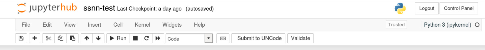

# uncodejupyterplugin
A JupyterHub extension for submitting notebook files to UNCode.

# Requirements

1. Python 3.5+
2. pip
3. JupyterHub

# Directions

## Linux / macOS

##### With Anaconda:
Follow these steps if you are running Jupyter Notebooks through Anaconda:

1. conda install git pip
2. pip install git+https://github.com/ranjiGT/uncodejupyterplugin
3. jupyter serverextension enable --py uncodejupyterplugin
4. jupyter nbextension install --user --py uncodejupyterplugin
5. jupyter nbextension enable --user --py uncodejupyterplugin
7. Download the file env.sh or clone the repository and run the command below
8. sh env.sh

You can skip the 7th and 8th steps and manually run the following commands:
1. jupyterhub --generate-config
2. Add the following line at the end of ~/.jupyter/jupyterhub_config.py
    - c.NotebookApp.disable_check_xsrf = True 
    
##### With pip:

If you are not using Anaconda, use the following commands:

1. pip3 install git+https://github.com/ranjiGT/uncodejupyterplugin
2. jupyter serverextension enable --py uncodejupyterplugin
3. jupyter nbextension install --user --py uncodejupyterplugin
4. jupyter nbextension enable --user --py uncodejupyterplugin
5. Download the file env.sh or clone the repository and run the command below
6. sh env.sh

You can skip the 5th and 6th steps and manually run the following commands:
1. jupyterhub --generate-config
2. Add the following line at the end of ~/.jupyter/jupyterhub_config.py
    - c.NotebookApp.disable_check_xsrf = True 
    
## Windows

If you have Windows operating system, follow these steps:

1. Install Anaconda
2. Open Anaconda Prompt and run these commands:
3. conda install git pip
4. pip install git+https://github.com/ranjiGT/uncodejupyterplugin
5. jupyter serverextension enable --py uncodejupyterplugin
6. jupyter nbextension install --user --py uncodejupyterplugin
7. jupyter nbextension enable --user --py uncodejupyterplugin
8. jupyterhub --generate-config

This will generate a default config file and you will get the output like "Writing default config to: C:\Users\UserName\\.jupyter\jupyterhub_config.py"

Run the following command but make sure to change the path to the ones returned by the above command

9. echo c.NotebookApp.disable_check_xsrf = True >> C:\Users\UserName\\.jupyter\jupyterhub_config.py

# Assignment Indentification

The UNCode assignment indetification parameters are fetched from the first cell. Paste the following comments in the first cell and change the values with your assignment parameters.

    # Do not edit this cell

    # course: 123
    # a: Assignment 1
    # d: HPI

# Screenshots

#### Submit to UNCode button on JupyterHub

